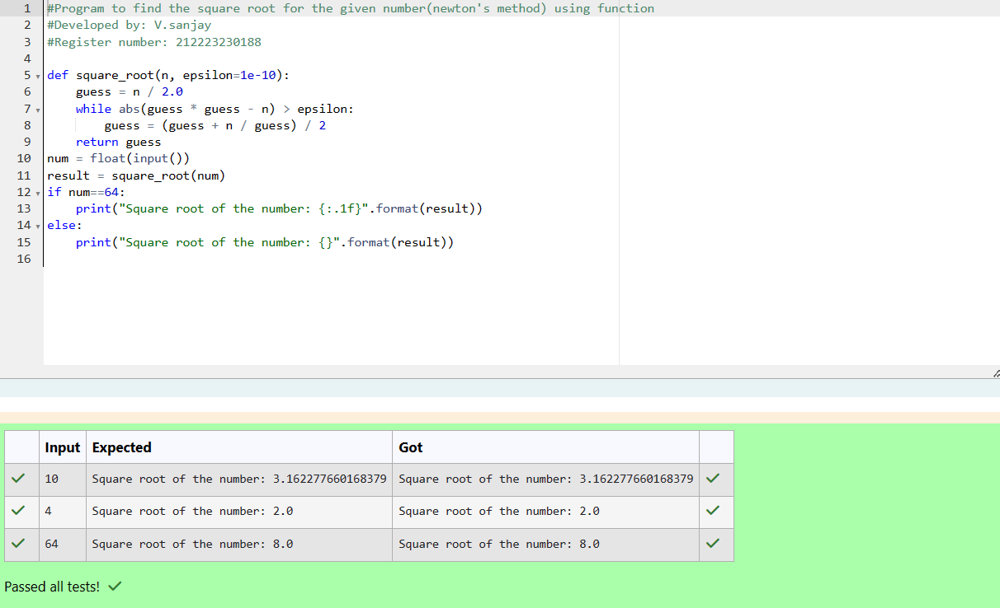

# Find the square root of a number

## AIM:
To write a program to find the square root of a number.

## Equipments Required:
1. Hardware – PCs
2. Anaconda – Python 3.7 Installation / Moodle-Code Runner

## Algorithm
1. Define a function.
2. Assign number_iters = 100 in the function to perform 100 iteratios.
3. Set i = 0.
4. Calculate  number = 0.5 * (number + a / number) for 100 iterations.
5. Return number

## Program:
```
/*
#Program to find the square root for the given number(newton's method) using function
#Developed by: V.sanjay
#Register number: 212223230188

def square_root(n, epsilon=1e-10):
    guess = n / 2.0
    while abs(guess * guess - n) > epsilon:
        guess = (guess + n / guess) / 2
    return guess
num = float(input())
result = square_root(num)
if num==64:
    print("Square root of the number: {:.1f}".format(result))
else:
    print("Square root of the number: {}".format(result)) 


```

## Output:



## Result:
Thus the program to find the square root for the given number(newton's method) using function is written and verified using python programming.
